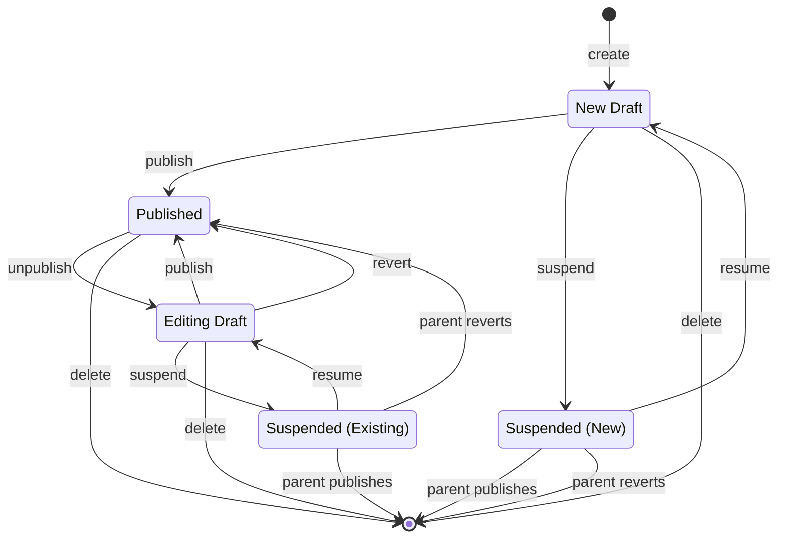

# Core Concepts

Understanding the fundamental concepts behind Publisher will help you effectively implement content publishing workflows in your application.

## The Publishing Problem

In content management systems, editors often need to make changes to published content without those changes being visible to site visitors until they're ready. Traditional approaches either:

1. **Overwrite published content** - Changes are immediately visible, which can expose incomplete work
2. **Create duplicate records** - Maintain separate draft and published records, leading to complex synchronization

Publisher solves this by storing draft changes in a JSON column alongside the published attributes, giving you the best of both worlds.

## Workflow States

Every publishable model has a workflow state stored in the `status` column (configurable). The default states are:

| State       | Description                                        |
| ----------- | -------------------------------------------------- |
| `published` | Content is visible to all users                    |
| `draft`     | Content is being edited, hidden from regular users |

```php
use Plank\Publisher\Enums\Status;

// Check current state
$post->status === Status::PUBLISHED;
$post->status === Status::DRAFT;

// Using helper methods
$post->isPublished();
$post->isNotPublished();
```

## How Draft Storage Works

When a model is in draft state, attribute changes are automatically stored in the `draft` JSON column instead of overwriting the published values:

```php
// Create a new post (starts as draft)
$post = Post::create(['title' => 'My Post', 'content' => 'Hello']);

// The post's attributes in the database:
// title: 'My Post' (in draft column as JSON)
// content: 'Hello' (in draft column as JSON)
// status: 'draft'

// Publish the post
$post->update(['status' => Status::PUBLISHED]);

// Now attributes are in their regular columns:
// title: 'My Post'
// content: 'Hello'
// draft: null
// status: 'published'

// Make edits to published content
$post->update(['title' => 'Updated Title', 'status' => Status::DRAFT]);

// The database now contains:
// title: 'My Post' (original published value)
// draft: {"title": "Updated Title"} (new draft value)
// status: 'draft'
```

## Draft Content Visibility

Publisher uses a global scope to control which records are visible. The visibility depends on context:

### Public Context (Draft Restricted)

When draft content is restricted (default for public-facing pages):

-   Only `published` records are returned
-   Draft attributes are hidden
-   Users see the live, published version

### Admin Context (Draft Allowed)

When draft content is allowed (admin panels, preview mode):

-   All records are returned (except those queued for deletion)
-   Draft attributes are automatically merged into the model
-   Users see the current working version

```php
use Plank\Publisher\Facades\Publisher;

// Programmatically control visibility
Publisher::allowDraftContent();
Publisher::restrictDraftContent();

// Execute code with specific visibility
Publisher::withDraftContent(function () {
    // Draft content visible here
    return Post::all();
});

Publisher::withoutDraftContent(function () {
    // Only published content visible
    return Post::all();
});
```

## The has_been_published Flag

This boolean column tracks whether a model has ever been published:

-   **New drafts**: `has_been_published = false`
-   **After first publish**: `has_been_published = true` (permanently)

This is important for the **revert** functionality, which only works on previously published content.

## Publishing Lifecycle

The state machine below shows all valid states (combinations of `status`, `has_been_published`, and `should_delete`) and the transitions between them.



### State Descriptions

| State | `status` | `has_been_published` | `should_delete` | Description |
| ----- | -------- | -------------------- | --------------- | ----------- |
| **New Draft** | `draft` | `false` | `false` | Content just created, never published. Changes stored in `draft` column. |
| **Published** | `published` | `true` | `false` | Content is live. Attributes in regular columns, `draft` is null. |
| **Editing Draft** | `draft` | `true` | `false` | Previously published content being edited. Published values in columns, changes in `draft`. |
| **Suspended (New)** | `draft` | `false` | `true` | New content queued for deletion when parent publishes. Hidden from queries. |
| **Suspended (Existing)** | `draft` | `true` | `true` | Previously published content queued for deletion. Will be restored if parent reverts. |

### Publishing

When you change the status to `published`:

1. `publishing` event fires (can be cancelled)
2. Draft attributes are moved to regular columns
3. `draft` column is cleared
4. `has_been_published` is set to `true`
5. `published` event fires
6. Dependent models and pivot relationships are published

### Unpublishing

When you change the status away from `published`:

1. `unpublishing` event fires (can be cancelled)
2. Current attributes are copied to the `draft` column
3. Original published values are restored from the database
4. `unpublished` event fires

### Reverting

When you call `revert()` (only available if `has_been_published` is true):

1. `reverting` event fires
2. Draft column is cleared
3. Status is set to `published`
4. Model is refreshed from the database (restoring published values)
5. Dependent models and pivot relationships are reverted
6. `reverted` event fires

```php
// Only works if the post has been published before
$post->revert();
```

## Queued Deletions (should_delete)

When a model depends on a parent publishable model and is deleted while the parent is in draft state, the model is "suspended" rather than immediately deleted:

-   `should_delete` is set to `true`
-   The model is hidden from queries (via global scope)
-   When the parent is published, suspended models are deleted
-   When the parent is reverted, suspended models are restored

This ensures that deleting related content in draft mode can be undone if the parent is reverted, and that it does not go missing before the changes to the parent have been published.

## Key Methods

| Method                   | Description                                |
| ------------------------ | ------------------------------------------ |
| `isPublished()`          | Check if currently published               |
| `isNotPublished()`       | Check if currently in draft                |
| `isBeingPublished()`     | Check if status is changing to published   |
| `isBeingUnpublished()`   | Check if status is changing from published |
| `hasEverBeenPublished()` | Check if ever been published               |
| `revert()`               | Discard draft and restore published state  |
| `isSuspended()`          | Check if queued for deletion               |
| `suspend()`              | Mark for deletion on parent publish        |
| `resume()`               | Clear deletion queue flag                  |

## Next Steps

-   Learn about [Draft Management](../features/draft-management.md) in detail
-   Understand [Publishable Relationships](../features/publishable-relationships.md)
-   Configure [Middleware](../features/middleware.md) for your routes
